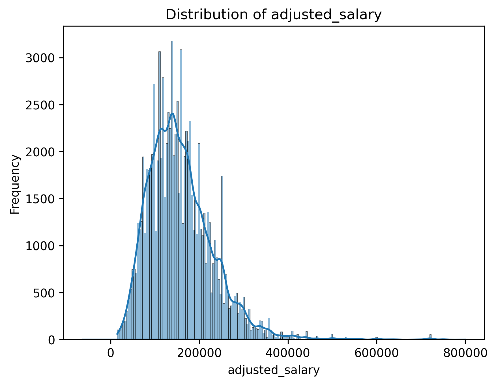
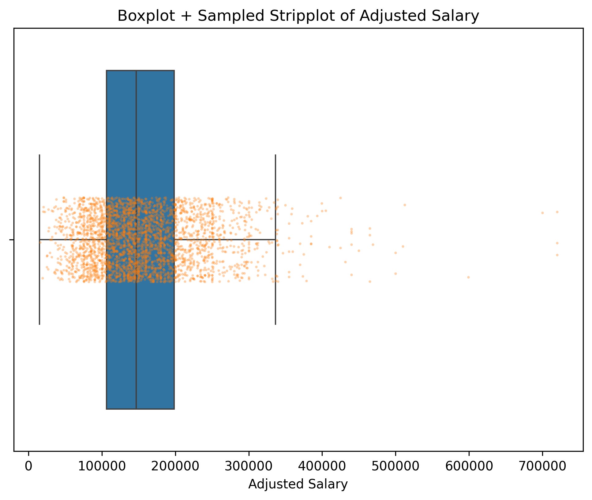
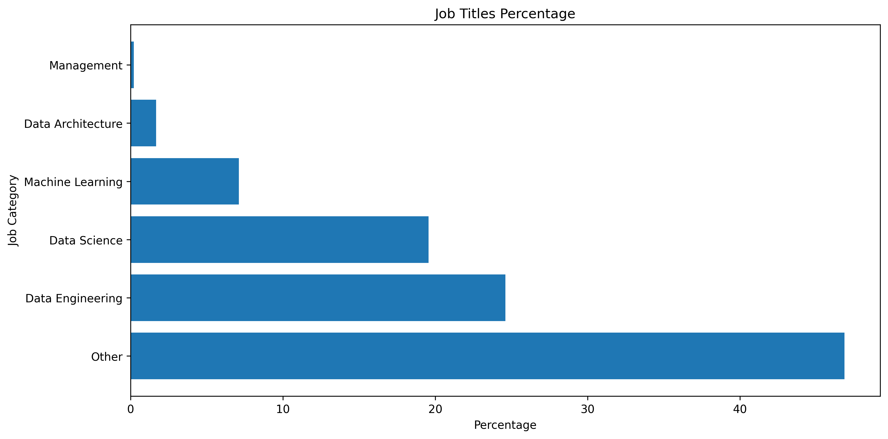
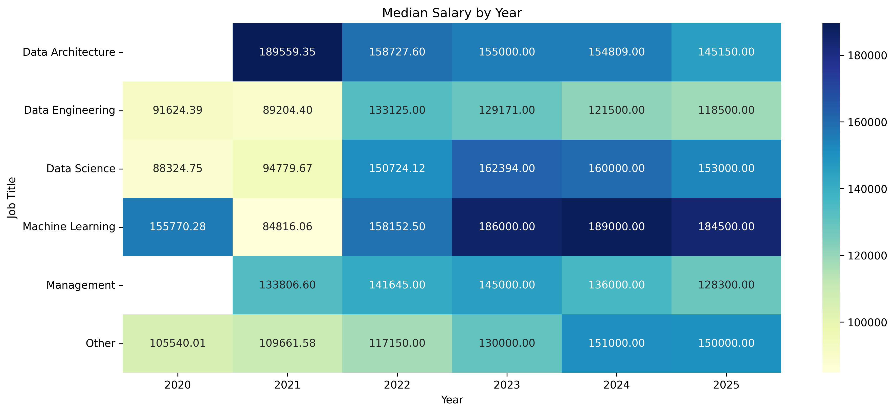
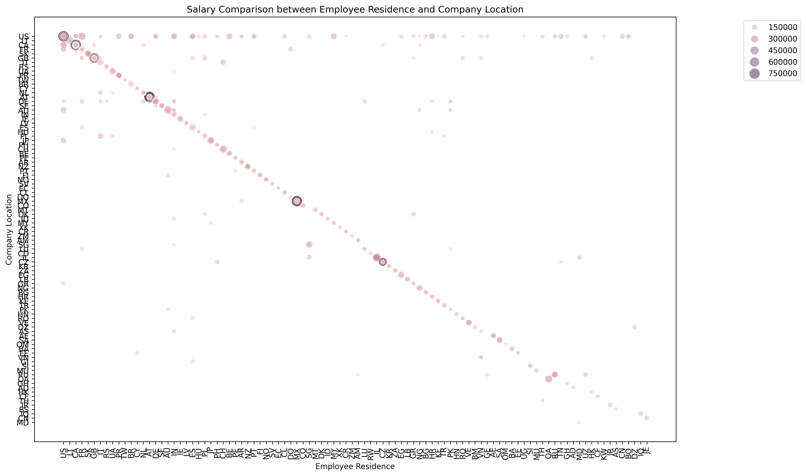
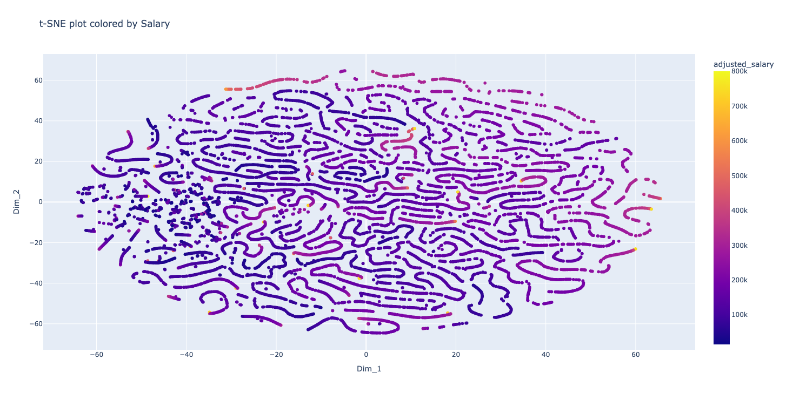
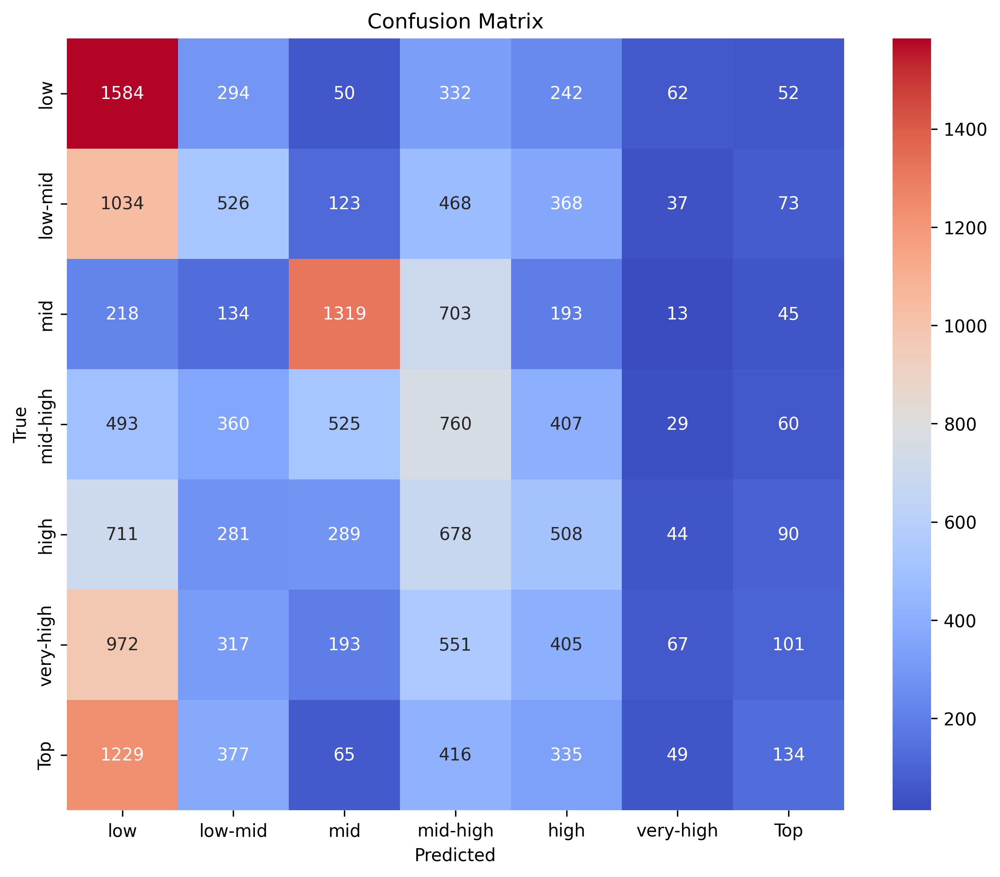

# Data Science Jobs & Salaries Analysis

**A comprehensive analysis of data science job roles and global salary trends, combining exploratory data analysis with machine learning based salary range prediction.**

---

## Overview
This project explores global data science and tech job listings to understand how job characteristics influence salary outcomes.  
The analysis focuses on uncovering patterns across experience levels, job roles, locations, and work arrangements, followed by building and evaluating machine learning models to predict **salary ranges**.

The project emphasizes **business data science workflows**, including data cleaning, exploratory analysis, feature engineering, visualization, and predictive modeling.

---

## Objectives
- Analyze salary trends across data science and tech roles  
- Understand the impact of experience, location, company size, and remote work  
- Identify key drivers of salary variation  
- Build and evaluate machine learning models to predict salary tiers  

---

### Source file:

Data can be viewed at --> Data/DataScience_salaries_2025.xlsx

This Data was extracted from : https://www.kaggle.com/datasets/saurabhbadole/latest-data-science-job-salaries-2024

## Dataset
The dataset contains structured job level information, including:
- Job title and role category  
- Experience level  
- Employment type  
- Company location  
- Employee residence  
- Remote work ratio

---

## Data Preprocessing
Key preprocessing steps:
- Cleaning and standardization of categorical variables  
- Label encoding of categorical features  
- Salary normalization using Min-Max scaling  
- Outlier detection and removal using the **Interquartile Range (IQR)** method  
- Salary binning into **7 quantile salary ranges**:
  - Low
  - Low-Mid
  - Mid
  - Mid-High
  - High
  - Very-High
  - Top

---
## Exploratory Data Analysis (EDA)

### Salary Distribution
The adjusted salary distribution reveals right-skewness with high end outliers, motivating robust preprocessing and outlier handling.

---

### Salary Variability Across Roles & Employment Types
Box and strip plots highlight strong salary dispersion driven by seniority, role type, and employment structure.

---

### Job Title Representation
This visualization shows the proportion of different job roles within the dataset, providing insight into market demand.

---

### Salary Trends Over Time
Median salary trends demonstrate consistent growth over time, particularly for senior and specialized roles.

---

### Employee Residence vs Company Location
This comparison highlights geographic salary dynamics and the influence of remote work on compensation.

---

## Predictive Analysis

### Dimensionality Reduction (t-SNE)
t-SNE was used to explore natural clustering of job profiles and salary tiers in a reduced feature space.

---

### Model Evaluation
Multiple classification models were trained and compared, including:
- Logistic Regression  
- Random Forest Classifier  
- Gradient Boosting Classifier  

Evaluation metrics included accuracy, precision, recall, F1 score, and confusion matrix analysis.

---

## Key Findings
- Experience level is the strongest predictor of salary range  
- Senior and specialized roles show clearer salary separation  
- Remote roles remain competitive, especially at mid-to-senior levels  
- Tree-based models outperform linear models for salary tier classification

For more information about Key findings, view the 2 reports:  

EDA-Summary Of Findings.pdf

Salary Prediction and Insights Report.pdf

